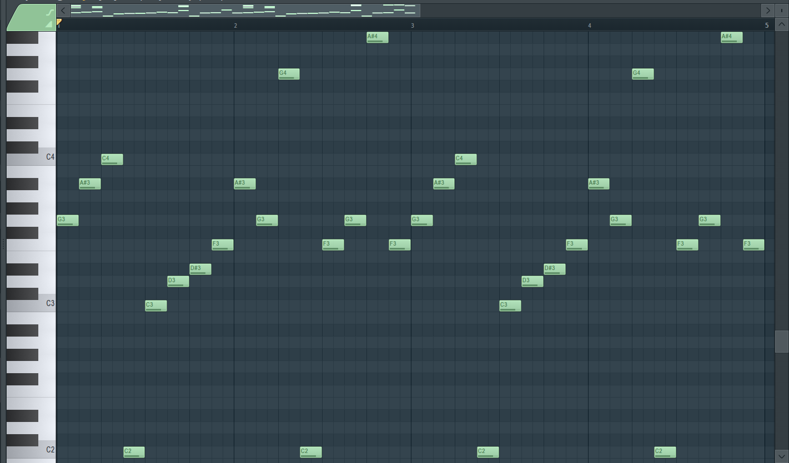

# Storyboard for the osu! mapset KOE
> Storyboard by [K4L1](https://osu.ppy.sh/users/11334594) and [Maot](https://osu.ppy.sh/users/3914271)

## Using the project

First of all, make sure your *osu!* installation pathing is located at `C:/osu`, your beatmap folder should be named `beatmap-637104724336517424-audio`

After that, clone the repository inside the projects folder in the storybrew installation.

## TODO List
* [x] Properly timestamps of the content to the storyboard.
* [x] Music Lyrics
* [x] The primary effects (eg. Particles, HitObjects Highlight, Animated Sprites, etc)
* [ ] Color Matching with the diffs
* [ ] Many other things that I'm lazy to put here.

# Map
- [Feryquitous - Koe](https://osu.ppy.sh/beatmapsets/1071084 "Feryquitous - Koe") (by K4L1)

**Previews**
- TODO(streamlabs)

# Hitsound

The mapset has some keysounds on Intro, verses and Outros. You can check the FL Project on "/hitsound/keysound" path.

## Intro

2 pianos.

**Piano 1**

**Piano 2**

## Verse 1

Piano that repeate a lot, below has these three structures.

## Verse 2

Long strings.

## Kiai

Piano chords.

# Info
Programs used:
- Storybrew -> *for creating every effect (basically whole sb)*
- Adobe Illustrator -> *image editing*
- Adobe Photoshop -> *image editing*
- photomosh.com -> *image editing*
- Sublime Text 3 -> *used for .osb & .osu file text editor*
- Visual Studio Code -> *used for .osb & .osu file text editor*
- FL Studio 20 -> *keysound and drumkit for hitsound*
- Audacity -> *keysound and samples editing for hitsound*
- Hitsound Copier -> *copy from hitsound diff to others*
- subtitletools.com -> *Subtitle Shifter for repeat the lyrics on srt file*

Language:
- C# -> *the language used in Storybrew*
- python -> *for script somethings*

# Thanks to
Mappers:
- Dada: [Osu!](https://osu.ppy.sh/u/9119507 "Dada") [Twitter](https://twitter.com/dada_38_ "@dada_38_")
- Rensia: [Osu!](https://osu.ppy.sh/users/9598254 "Rensia") [Twitter](https://twitter.com/OsuRensia "@OsuRensia")
- Maot: [Osu!](https://osu.ppy.sh/users/3914271 "Maot") [Twitter](https://twitter.com/maotovisk "@maotovisk")
- Nyxa: [Osu!](https://osu.ppy.sh/users/3408126 "Nyxa") [Twitter](https://twitter.com/NyxaNX "@NyxaNX")
- Cheri: [Osu!](https://osu.ppy.sh/u/5226970 "Cheri") [Twitter](https://twitter.com/Cheri_Osu "@Cheri_Osu")
- Sakura Airi: [Osu!](https://osu.ppy.sh/users/8682057 "Sakura Airi") [Twitter](https://twitter.com/SakuraAiriOsu "@SakuraAiriOsu")
- Kalindraz: [Osu!](https://osu.ppy.sh/users/2313166 "Kalindraz") [Twitter](https://twitter.com/kalindraz "@Kalindraz")
- Net0: [Osu!](https://osu.ppy.sh/users/5099768 "Net0") [Twitter](https://twitter.com/CZNet0 "@CZNet0")
- LMT: [Osu!](https://osu.ppy.sh/users/7262798 "LMT") [Twitter](https://twitter.com/utsmol_ "@utsmol_")
- yShadowXOP_: [Osu!](https://osu.ppy.sh/users/7754679 "yShadowXOP_") [Twitter](https://twitter.com/ShadouXis/ "@ShadouXis")
- Faito: [Osu!](https://osu.ppy.sh/users/9706291 "Faito") [Twitter](https://twitter.com/LuczLov "@LuczLov")
- Satellite: [Osu!](https://osu.ppy.sh/users/1661227 "Satellite") [Twitter](https://twitter.com/yuuhei "@yuuhei")
- Ciyus Miapah: [Osu!](https://osu.ppy.sh/users/2805457 "Ciyus Miapah") [Twitter](https://twitter.com/Fort_exe "@Fort_exe")
- reicavera: [Osu!](https://osu.ppy.sh/users/9314703 "reicavera")
- Nattu: [Osu!](https://osu.ppy.sh/users/1886722 "Nattu")

Storyboarders:
- Maot: [Osu!](https://osu.ppy.sh/users/3914271 "Maot") [Twitter](https://twitter.com/maotovisk "@maotovisk") -> *My right hand*

Hitsound:
- Maemi no Yume: [Osu!](https://osu.ppy.sh/users/4377273) [Twitter](https://twitter.com/Maemi_no_yume) -> *The diamond behind of keysound samples, guided me a lot*

Nominators:
- C:
- C:

# Creator
- Twitter: [@K4L1_FS](https://twitter.com/K4L1_FS "@K4L1_FS")
- Osu: [K4L1](https://osu.ppy.sh/u/11334594 "K4L1")
- My Page: [K4L1](https://lucasnathaniel.github.io "Github Page")

# Links
-> *osu! storyboarder banquet*

-> *Central de Mapping Brasileiro*

